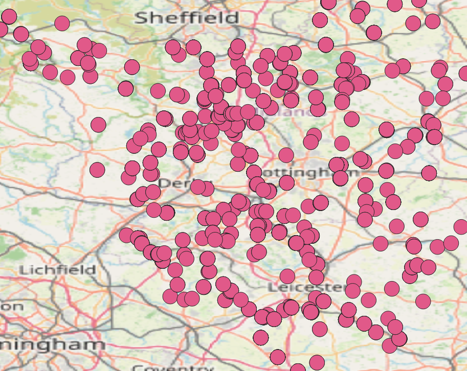
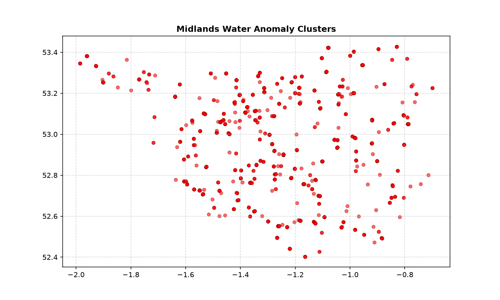

# 🌊 Project 1: Environmental Intelligence Pipeline & Spatial Anomaly Engine

## 🎯 Strategic Context & Project Objective
This project forms part of an **Integrated Environmental Analytics Portfolio**, turning raw, messy public utility records into a structured, production-ready spatial data asset. 

When treated as a flat spreadsheet, this master dataset (**57,049 rows × 17 variables**) causes severe software lag, truncated entries, and application crashes inside legacy programs like Microsoft Excel. This engineering pipeline migrates the entire analytical workload into an isolated **Python 3.11 environment running inside Visual Studio Code**, backed by an indexed **SQLite database layer** and verified spatially inside **QGIS**. 

By filtering, cleaning, and transforming this data, the engine successfully isolates **121 high-priority acute environmental incidents** across the Midlands catchment area, creating an unalterable audit trail for regional environmental risks.

---

## 👁️ Core Intelligence Visualizations

### 1. Geospatial Contamination Heatmap (QGIS Spatial Layer)
*Generated by exporting the local SQLite data engine output and performing Kernel Density Estimation (KDE) analytics inside QGIS.*


* **Analysis Focus:** Spatial distribution of point-source industrial runoff clusters. High-density zones track acute catchment breaches where Ammonia and BOD levels actively violate statutory environmental safety boundaries.

### 2. Algorithmic Cluster Verification (Python Engine Plot)
*Automated spatial scatter verification map generated directly by the core data pipeline infrastructure during the execution sequence.*


* **Analysis Focus:** Fast, macro-level algorithmic validation of regional hazard data distributions before deep geospatial projection processing.

---

## 🛠️ Integrated Technical Data Stack
* **Development Workspace:** Visual Studio Code (VS Code) utilizing an isolated Anaconda virtual environment interpreter.
* **Data Processing Engine:** Python 3.11 with Pandas for high-speed ETL operations and NumPy for structural array data handling.
* **Database Layer:** Local SQLite Database engine utilizing explicit data tracking tables and speed-optimized coordinate indexing.
* **Reporting & Document Generation:** ReportLab PDF compilation layout and Quarto Markdown (.qmd) notebook formats for reproducible analytical data sheets.
* **Spatial Data Intelligence:** QGIS (Geographic Information System) utilizing **EPSG:27700 (OSGB36 / British National Grid)** reprojections to map hot spots and pollution vectors.

---

## 📂 Structural Workspace Architecture
```text
📁 PROJECT 1 - EA WATER ANOMALIES/
├── 📄 README.md                        # Master portfolio operational runbook
├── 📄 requirements.txt                 # Reproducible pip dependency index
├── 📄 midlands_water.db                # SQLite database with structural coordinate indices
├── 📄 midlands_water_raw.csv           # Raw source ingestion ledger (57,049 rows)
│
├── 📁 scripts/
│   ├── water_anomaly_pipeline.py      # Core chemical/organic anomaly ETL & reporting engine
│   ├── scan_regions.py                # Regional administrative boundary scanner
│   └── isolate_local.py               # 45,360 record spatial extraction engine
│
├── 📁 outputs/
│   ├── midlands_anomaly_map.png        # 300 DPI Matplotlib scatter plot with hotspot annotations
│   └── Critical_Pollution_Audit.txt    # Production-ready text audit report ledger
│
└── 📁 documentation/
    ├── qgis_pollution_heatmap.png       # Exported QGIS Kernel Density Estimation layer
    └── Water_Pipeline_Documentation.pdf # Automated PDF compliance audit report with live metrics
```

---

## 🔍 Critical Anomalies & System Discoveries

The pipeline extracted **43,152 records** specifically for the local administrative area. It flagged major chemical and organic spikes far exceeding baseline safety regulations:

### 🧪 Severe Chemical Spikes (Ammoniacal Nitrogen as N)
*Background safety levels in clean water are typically below 0.5 mg/L.*
* **180.0 mg/L** | 2026-02-10 | Tomkins Farm Effluent Treatment Plant (Lat: 53.1957, Lon: -0.7576)
* **97.0 mg/L** | 2026-06-02 | Waterside Inn, Mountsorrel (Lat: 52.7321, Lon: -1.1390)
* **85.0 mg/L** | 2026-07-07 | Tomkins Farm Effluent Treatment Plant (Lat: 53.1957, Lon: -0.7576)

### 🧫 Extreme Organic Waste Spikes (Biochemical Oxygen Demand - BOD)
*High BOD readings indicate intense oxygen depletion caused by untreated sewage infrastructure leaks.*
* **1,060.0 mg/L** | 2026-04-27 | UWWTD Intake Self Monitoring from Tideswell STW (Lat: 53.2674, Lon: -1.7706)
* **1,000.0 mg/L** | 2026-04-13 | Private Sewage Effluent from Waterside Inn, Mountsorrel (Lat: 52.7321, Lon: -1.1390)
* **896.0 mg/L** | 2026-02-25 | UWWTD Intake Self Monitoring from Kilburn STW (Lat: 53.0003, Lon: -1.4409)

---

## 🗺️ QGIS Spatial Processing & Intelligence

To turn raw rows of numbers into actionable geographical insights, the points were mapped inside **QGIS**:

1. **CRS Reprojection Engine:** Shifted coordinates from standard global GPS degrees (EPSG:4326) into the precise **EPSG:27700 (OSGB36 / British National Grid)** coordinate reference system. This scales the map units into exact physical meters, allowing for accurate distance tracking.
2. **Kernel Density Estimation (KDE) Heatmap:** Created a continuous raster density heatmap using a **1,500-meter radius** weighted by the actual data values. This highlights severe hot spots (like the **Tideswell STW catchment zone**) rather than just counting the number of samples.
3. **IMINT Baseline Matching:** Used **Google Earth Pro’s Historical Imagery Slider** to track changes at high-risk coordinates over time, cross-referencing visual site updates with the dates of major chemical spikes.